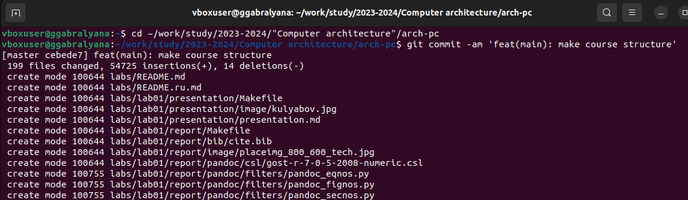
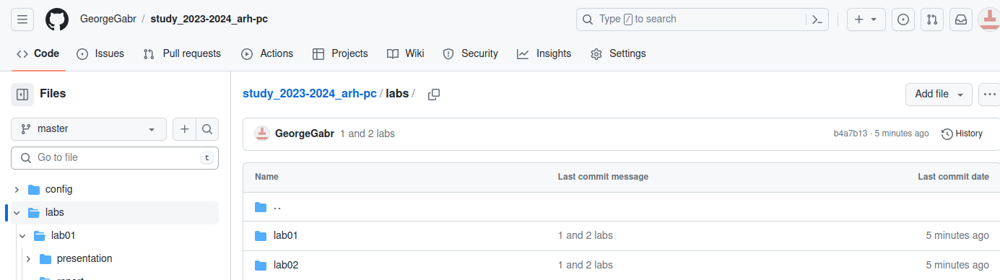

---
## Front matter
title: "Отчет по лабораторной работе №2"
subtitle: "Дисциплина: Архитектура компьютера"
author: "Габралян Георгий Александрович"

## Generic otions
lang: ru-RU
toc-title: "Содержание"

## Bibliography
bibliography: bib/cite.bib
csl: pandoc/csl/gost-r-7-0-5-2008-numeric.csl

## Pdf output format
toc: true # Table of contents
toc-depth: 2
lof: true # List of figures
lot: true # List of tables
fontsize: 12pt
linestretch: 1.5
papersize: a4
documentclass: scrreprt
## I18n polyglossia
polyglossia-lang:
  name: russian
  options:
	- spelling=modern
	- babelshorthands=true
polyglossia-otherlangs:
  name: english
## I18n babel
babel-lang: russian
babel-otherlangs: english
## Fonts
mainfont: PT Serif
romanfont: PT Serif
sansfont: PT Sans
monofont: PT Mono
mainfontoptions: Ligatures=TeX
romanfontoptions: Ligatures=TeX
sansfontoptions: Ligatures=TeX,Scale=MatchLowercase
monofontoptions: Scale=MatchLowercase,Scale=0.9
## Biblatex
biblatex: true
biblio-style: "gost-numeric"
biblatexoptions:
  - parentracker=true
  - backend=biber
  - hyperref=auto
  - language=auto
  - autolang=other*
  - citestyle=gost-numeric
## Pandoc-crossref LaTeX customization
figureTitle: "Рис."
tableTitle: "Таблица"
listingTitle: "Листинг"
lofTitle: "Список иллюстраций"
lotTitle: "Список таблиц"
lolTitle: "Листинги"
## Misc options
indent: true
header-includes:
  - \usepackage{indentfirst}
  - \usepackage{float} # keep figures where there are in the text
  - \floatplacement{figure}{H} # keep figures where there are in the text
---

# Цель работы

Изучение идеологии и применение средств контроля версий. Приобретение
практических навыков по работе с системой git.

# Выполнение лабораторной работы

Сначала создаём учетную запись на сайте http://github.com/ . (рис. @fig:001).

{#fig:001 width=70%}

Затем делаем предварительную конфигурацию git с помощью ввода в терминале
команды git config --global и user.name/email. (рис. @fig:002).

{#fig:002 width=70%}

Настраиваем utf-8 в выводе сообщений git с помощью core.quotepath false.
Называем начальную ветку master и потом настраиваем параметры autocrlf и
safecrlf (рис. @fig:003).

{#fig:003 width=70%}

{#fig:004 width=70%}

Далее создаём SSH ключ для идентификации пользователя на сервере (рис. @fig:005).

{#fig:005 width=70%}

{#fig:006 width=70%}

{#fig:007 width=70%}

Создаём каталог для предмета Архитектура компьютера, который имеет путь:
~/work/study/2023-2024/»Computer architecture», используя для этого команду mkdir
и ключ p (рис. @fig:008).

{#fig:008 width=70%}

Ещё необходимо создать репозиторий на основе шаблона. Делается это через web-
интерфейс github. Переходим на страницу репозитория с шаблоном курса,
используем шаблон и задаём имя репозитория (рис. @fig:009).

{#fig:009 width=70%}

Затем открываем терминал и переходим в каталог курса. Клонируем созданный
репозиторий (рис. @fig:0010).

{#fig:010 width=70%}

{#fig:011 width=70%}

И наконец, настройка каталога.
Сначала переходим в каталог и удаляем лишние файлы, далее создаём необходимые
каталоги и отправляем файлы на сервер (рис. @fig:012).

{#fig:012 width=70%}

{#fig:013 width=70%}

{#fig:014 width=70%}

Убеждаемся в правильности созданной иерархии в локальном репозитории и на
GitHub (рис. @fig:015).

{#fig:015 width=70%}

{#fig:016 width=70%}

# Задание для самостоятельной работы

1. Создайте отчет по выполнению лабораторной работы в
соответствующем каталоге рабочего пространства.

Перемещаем файл в нужные каталоги, используя команду mv (рис. @fig:017).

{#fig:017 width=70%}

2. Скопируйте отчеты по выполнению предыдущих лабораторных работ в
соответствующие каталоги рабочего пространства.
Копируем 1-й отчет в нужный каталог, для этого используем команду копирования.
Убеждаемся в правильности. (рис. @fig:018).

{#fig:018 width=80%}

{#fig:019 width=80%}

3. Загрузите файлы на GitHub.
Для загрузки файлов на GitHub нужно перейти в необходимые каталоги и
использовать команды git add, git commit и git push (рис. @fig:020).

{#fig:020 width=80%}

{#fig:021 width=80%}

# Выводы

В ходе выполнения данной лабораторной работы мы изучили идеологию и
применение средств контроля версий и приобрели практические навыки по работе
с системой git.
