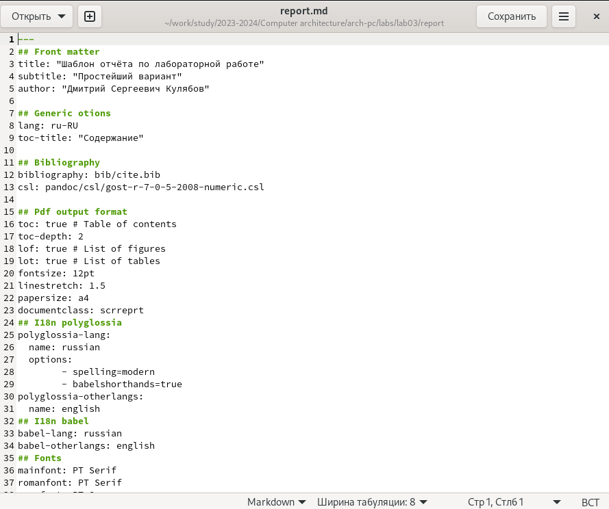

---
## Front matter
title: "Отчет по лабораторной работе №3"
subtitle: "Дисциплина: Архитектура компьютера"
author: "Габралян Георгий Александрович"

## Generic otions
lang: ru-RU
toc-title: "Содержание"

## Bibliography
bibliography: bib/cite.bib
csl: pandoc/csl/gost-r-7-0-5-2008-numeric.csl

## Pdf output format
toc: true # Table of contents
toc-depth: 2
lof: true # List of figures
lot: true # List of tables
fontsize: 12pt
linestretch: 1.5
papersize: a4
documentclass: scrreprt
## I18n polyglossia
polyglossia-lang:
  name: russian
  options:
	- spelling=modern
	- babelshorthands=true
polyglossia-otherlangs:
  name: english
## I18n babel
babel-lang: russian
babel-otherlangs: english
## Fonts
mainfont: PT Serif
romanfont: PT Serif
sansfont: PT Sans
monofont: PT Mono
mainfontoptions: Ligatures=TeX
romanfontoptions: Ligatures=TeX
sansfontoptions: Ligatures=TeX,Scale=MatchLowercase
monofontoptions: Scale=MatchLowercase,Scale=0.9
## Biblatex
biblatex: true
biblio-style: "gost-numeric"
biblatexoptions:
  - parentracker=true
  - backend=biber
  - hyperref=auto
  - language=auto
  - autolang=other*
  - citestyle=gost-numeric
## Pandoc-crossref LaTeX customization
figureTitle: "Рис."
tableTitle: "Таблица"
listingTitle: "Листинг"
lofTitle: "Список иллюстраций"
lotTitle: "Список таблиц"
lolTitle: "Листинги"
## Misc options
indent: true
header-includes:
  - \usepackage{indentfirst}
  - \usepackage{float} # keep figures where there are in the text
  - \floatplacement{figure}{H} # keep figures where there are in the text
---

# Цель работы

Целью работы является освоение процедуры оформления отчётов с помощью легковесного языка разметки Markdown.

# Выполнение лабораторной работы

Открываем терминал, затем переходим в каталог курса, обновляем локальный репозиторий и переходим в каталог с шаблоном /lab03/report (рис. @fig:001).

{#fig:001 width=70%}

Далее компилируем шаблон пользуясь командой make и проверяем правильность компиляции (рис. @fig:002).

{#fig:002 width=70%}

{#fig:002 width=70%}

Удаляем файлы, полученные с помощью Makefile и его команды make clean. (рис. @fig:003).

{#fig:003 width=70%}

Затем мы открываем файл report.md, изучаем его структуру и заполняем отчёт по третьей лабораторной работе (рис. @fig:004).

{#fig:004 width=70%}

И наконец компилируем файл командой make и отправляем наш отчёт на GitHub (рис. @fig:005).

{#fig:005 width=70%}

# Задание для самостоятельной работы

1. В соответствующем каталоге сделайте отчёт по лабораторной работе №2 в формате
Markdown. В качестве отчёта необходимо предоставить отчёты в 3 форматах: pdf, docx
и md.

Используем графический интерфейс. Переходим в каталог report внутри папки lab02, и изменяем содержимое отчёта и компилируем документы. Затем проверяем документы в папке (рис. @fig:006).

{#fig:006 width=70%}

2. Загрузите файлы на github.
Загружаем файлы на GitHub. Для этого вводим необходимую последовательность команд (рис. @fig:007).

{#fig:007 width=80%}

Проверяем файлы на GitHub (рис. @fig:008).

{#fig:008 width=80%}

# Выводы

В ходе выполнения лабораторной работы я освоил процедуры оформления отчётов с помощью легковесного языка разметки Markdown и повторил материал, изученный в предыдущих лабораторных работах.
