---
## Front matter
title: "Отчёт по лабораторной работе №9"
subtitle: "дисциплина: Архитектура компьютера"
author: "Габралян Георгий Александрович"

## Generic otions
lang: ru-RU
toc-title: "Содержание"

## Bibliography
bibliography: bib/cite.bib
csl: pandoc/csl/gost-r-7-0-5-2008-numeric.csl

## Pdf output format
toc: true # Table of contents
toc-depth: 2
lof: true # List of figures
lot: true # List of tables
fontsize: 12pt
linestretch: 1.5
papersize: a4
documentclass: scrreprt
## I18n polyglossia
polyglossia-lang:
  name: russian
  options:
	- spelling=modern
	- babelshorthands=true
polyglossia-otherlangs:
  name: english
## I18n babel
babel-lang: russian
babel-otherlangs: english
## Fonts
mainfont: PT Serif
romanfont: PT Serif
sansfont: PT Sans
monofont: PT Mono
mainfontoptions: Ligatures=TeX
romanfontoptions: Ligatures=TeX
sansfontoptions: Ligatures=TeX,Scale=MatchLowercase
monofontoptions: Scale=MatchLowercase,Scale=0.9
## Biblatex
biblatex: true
biblio-style: "gost-numeric"
biblatexoptions:
  - parentracker=true
  - backend=biber
  - hyperref=auto
  - language=auto
  - autolang=other*
  - citestyle=gost-numeric
## Pandoc-crossref LaTeX customization
figureTitle: "Рис."
tableTitle: "Таблица"
listingTitle: "Листинг"
lofTitle: "Список иллюстраций"
lotTitle: "Список таблиц"
lolTitle: "Листинги"
## Misc options
indent: true
header-includes:
  - \usepackage{indentfirst}
  - \usepackage{float} # keep figures where there are in the text
  - \floatplacement{figure}{H} # keep figures where there are in the text
---

# Цель работы

Приобретение навыков написания программ с использованием подпрограмм. Знакомство с методами отладки при помощи GDB и его основными возможностями.

# Выполнение лабораторной работы

Создаём каталог для выполнения лабораторной работы номер 9, переходим в него и создаём файл `lab09-1.asm`. (рис. @fig:001)

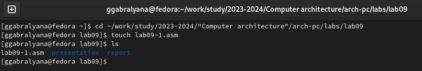{#fig:001 width=70%}

Рассматриваем программу вычисления арифметического выражения $f(x) = 2𝑥 + 7$ . Вводим текст этой программы в файл lab09-1.asm . (рис. @fig:002)

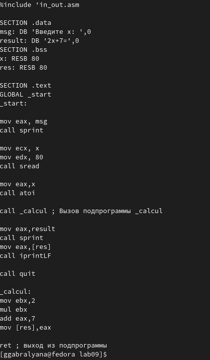{#fig:002 width=70%}

Создаём исполняемый файл и сразу проверяем его работу. (рис. @fig:003)

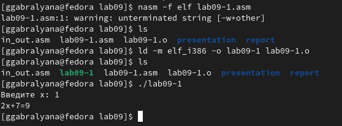{#fig:003 width=70%}

Теперь изменяем текст программы, добавляя подпрограмму `_subcalcul` в подпрограмму `_calcul`, для вычисления `f(g(x))`, где `x` вводится с клавиатуры, `f(x) = 2x + 7`, `g(x) = 3x − 1`. (рис. @fig:004)

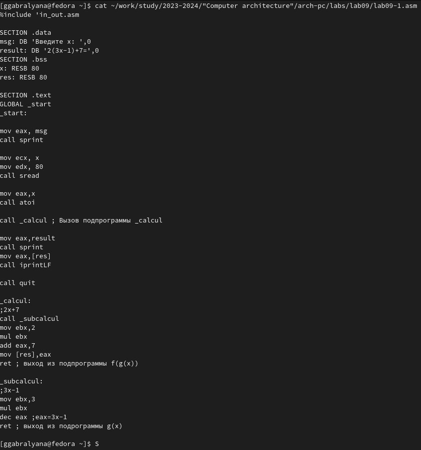{#fig:004 width=70%}

Создаём исполняемый файл, проверяем его работу. (рис. @fig:005)

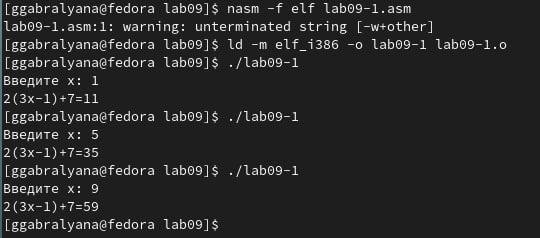{#fig:005 width=70%}

Создаём файл `lab09-2.asm`, заполняем его текстом программы печати сообщения *Hello world!* (рис. @fig:006)

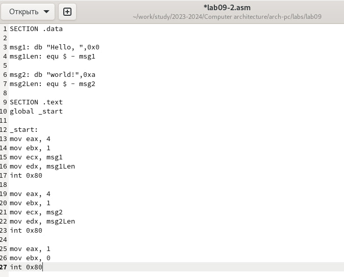{#fig:006 width=70%}

Получаем исполняемый файл. Для работы с GDB в исполняемый файл нужно добавить отладочную информацию, для этого используем ключ `-g`. (рис. @fig:007)

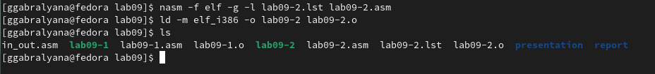{#fig:007 width=70%}

Загружаем исполняемый файл в отладчик GDB. (рис. @fig:008)

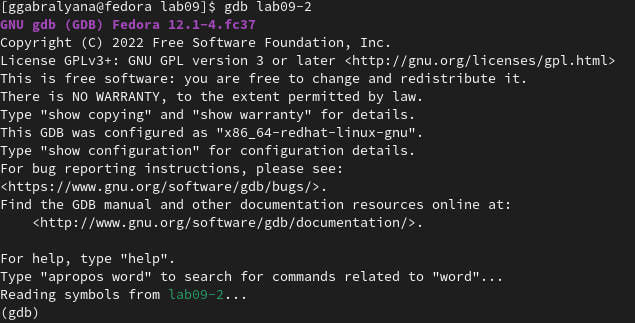{#fig:008 width=70%}

Проверяем работу программы, запуская её в GDB с помощью команды `run` (рис. @fig:009).

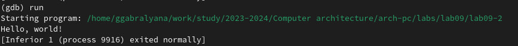{#fig:009 width=70%}

Для более детального анализа программы устанавливаем брейкпоинт на метку `_start`, запускаем её. (рис. @fig:010)

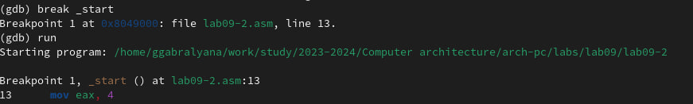{#fig:010 width=70%}

Далее смотрим дисассимилированный код программы с помощью команды `disassemble` начиная с `_start`. (рис. @fig:011)

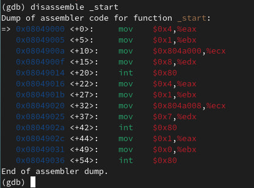{#fig:011 width=70%}

Переключаемся на отображение команд с синтаксисом Intel. (рис. @fig:012)

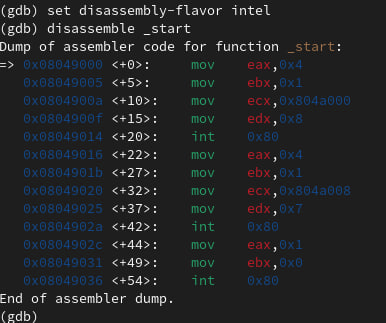{#fig:012 width=70%}

Как можно увидеть, в синтаксисе Intel после команды выводится регистр, куда помещается значение, и затем адрес помещаемого значения или число. В свою очередь, в синтаксисе ATT сначала выводится ссылка на заносимое в регистр значение, и только после неё регистр с символом `%`.

Включаем режим псевдографики для более удобного анализа программы с помощью `layout asm` и `layout regs` (рис. @fig:013)

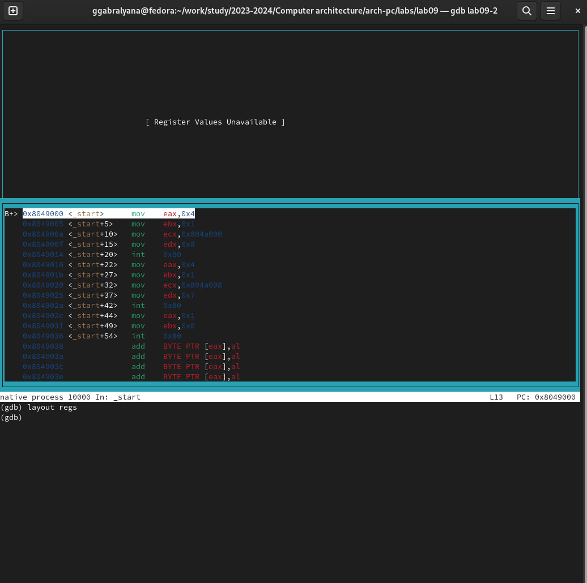{#fig:013 width=70%}

Ранее была установлена точка останова по имени метки `_start`. Проверяем это с помощью команды `info breakpoints` (рис. @fig:014)

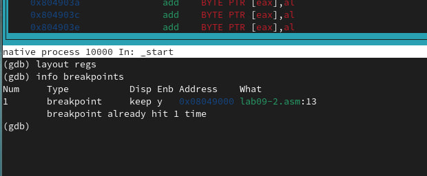{#fig:014 width=70%}

Устанавливаем еще одну точку останова по адресу инструкции `mov ebx,0x0`. В нашем случае это адрес: `0x8049031`. Затем смотрим информацию о всех точках останова (рис. @fig:015).

{#fig:015 width=70%}

Выполняем 5 инструкций с помощью команды `si` и следим за изменениями в значениях регистров (рис. @fig:016 - @fig:020). 

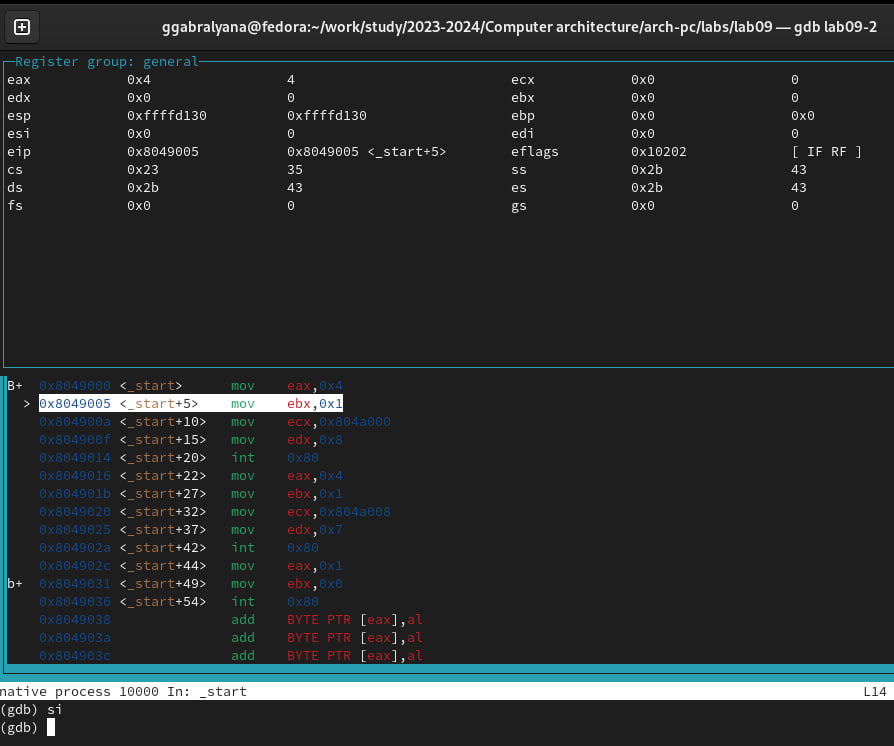{#fig:016 width=70%}

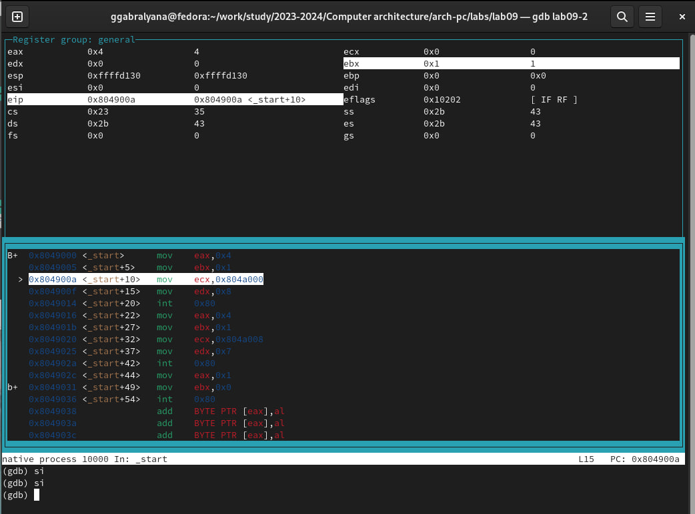{#fig:017 width=70%}

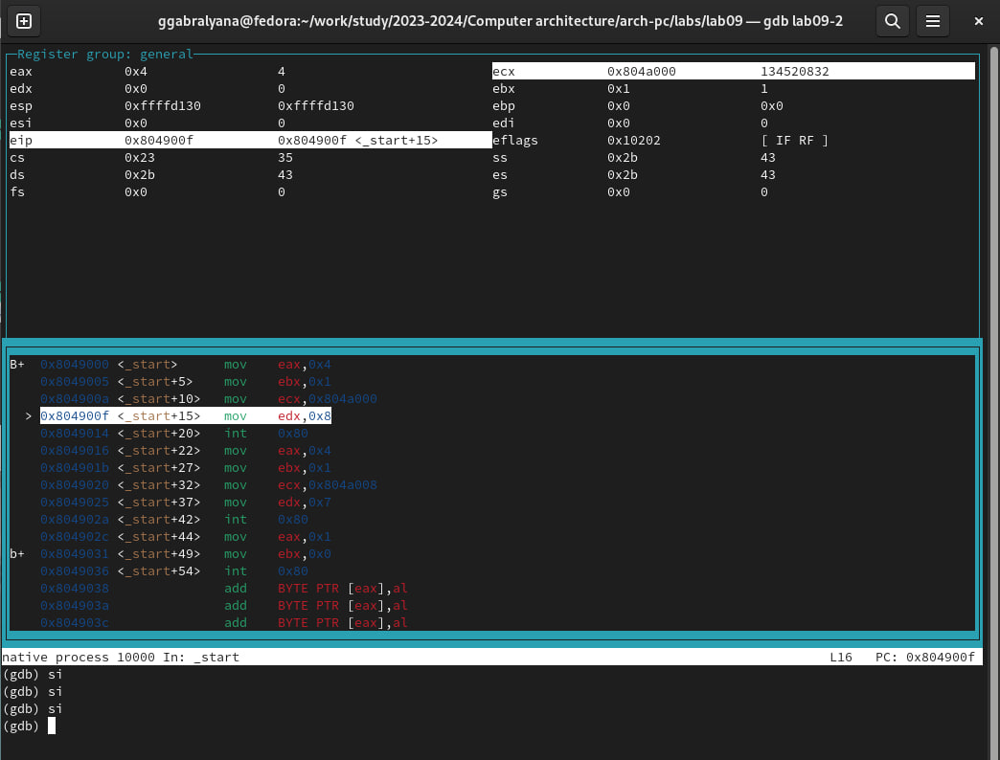{#fig:018 width=70%}

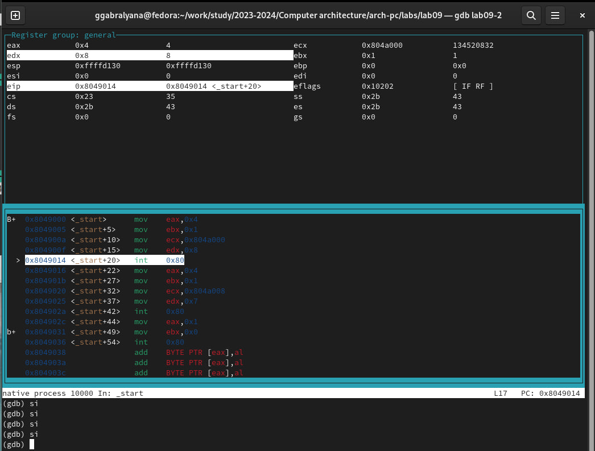{#fig:019 width=70%}

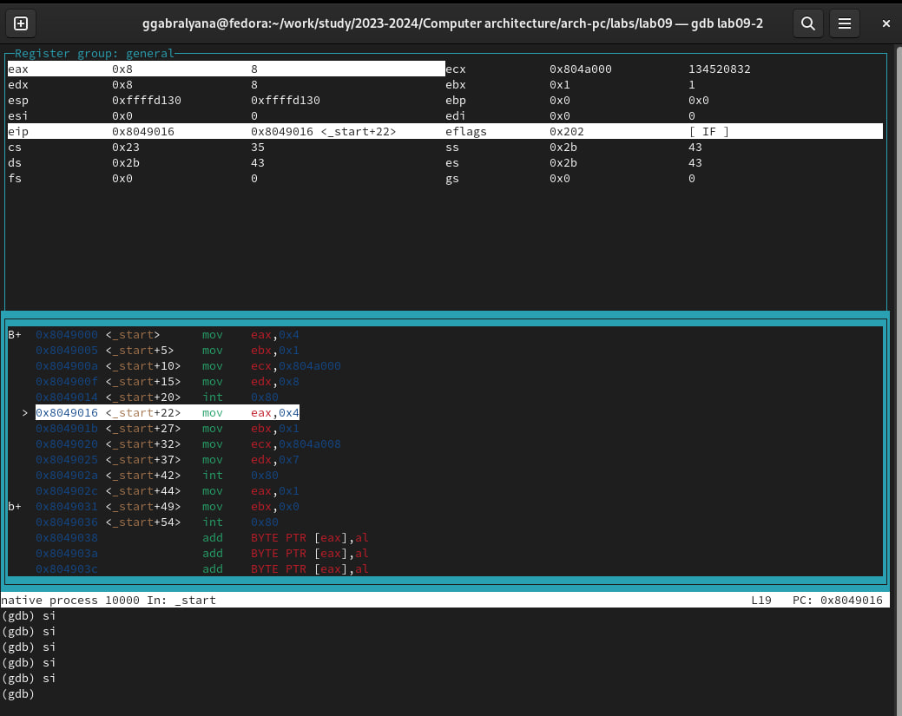{#fig:020 width=70%}

Как видно на верхней панели, изменились значения регистров `eax`, `ecx`, `ebx` и `edx`.

Теперь смотрим значение переменной `msg1` по имени (рис. @fig:021).

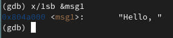{#fig:021 width=70%}

Выводится строка "Hello, ". 

Теперь смотрим значение переменной `msg2` по адресу. Адрес переменной определяем по дисассемблированной инструкции. (рис. @fig:022).

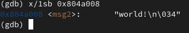{#fig:022 width=70%}

Далее изменяем первый символ в переменных `msg1` и `msg2`(рис. @fig:023).

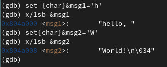{#fig:023 width=70%}

Выводим в различных форматах значение регистра `edx`(рис. @fig:024).

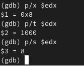{#fig:024 width=70%}

И теперь, используя команду `set`, изменяем значение регистра `ebx` (рис. @fig:025).

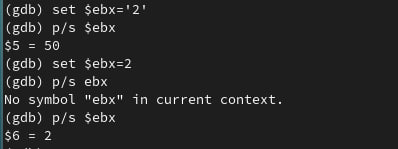{#fig:025 width=70%}

Сначала мы занесли в регистр `ebx` символ '2', вот почему после запроса `p/s` на вывод значения регистра на экране мы увидели код символа "2", то есть 50.
А затем, когда число 2 изначально было занесено в регистр, команда `p/s $ebx` вывела значение 2.

Завершаем выполнение программы с помощью `c` (рис. @fig:026).

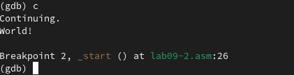{#fig:026 width=70%}

И сразу после этого с помощью команды `quit` выходим из отладчика `gdb`.

Копируем файл `lab8-2.asm`, который был создан при выполнении лабораторной работы 8, в файл с именем `lab09-3.asm` и создаём исполняемый файл с ключом `-g` и файлом листинга (рис. @fig:027).

{#fig:027 width=70%}

Для того чтобы загрузить в GDB программы с аргументами нужно использовать ключ `--args`. Загружаем файл в отладчик, указавыя аргументы (рис. @fig:028).

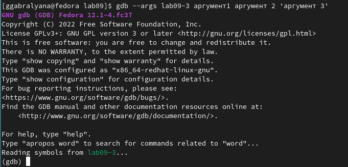{#fig:028 width=70%}

Сначала устанавливаем точку останова перед первой инструкцией в программе, запускаем её (рис. @fig:029).

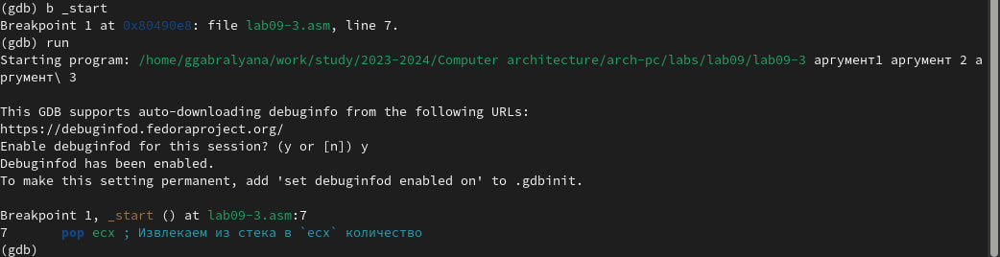{#fig:029 width=70%}

Адрес вершины стека хранится в регистре `esp` и по нему располагается число, которое равно количеству аргументов командной строки (рис. @fig:030).

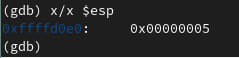{#fig:030 width=70%}

Число аргументов равно 5, то есть имя программы `lab09-3` и сами аргументы: `аргумент1`, `аргумент`, `2` и `аргумент 3`.

Просматриваем остальные позиции (рис. @fig:031).

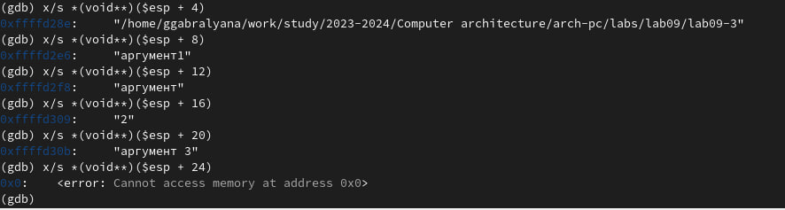{#fig:031 width=70%}

По адесу `[esp+4]` располагается адрес в памяти, где находиться имя программы. 
По адесу `[esp+8]` храниться адрес первого аргумента. 
По аресу `[esp+12]` – второго и так далее. 
Как можно заметить, шаг изменения равен 4. Шаг имеет такое значение, так как при добавлении значения каждого аргумента в стек, значение регистра `esp` увеличивается на 4. 

# Выполнение заданий для самостоятельной работы

**Задание №1**

Преобразовываем программу из лабораторной работы 8, реализовывая вычисление значения функции $f(x)$ как подпрограмму.

В лабораторной работе 8 мы реализовывали вычисление в цикле следующей функции:

$$
f(x) = 6x + 13
$$

Теперь для вычисления значения этой функции в цикле мы вызываем вспомогательную подпрограмму. Создаём файл `f1.asm` и вписываем в него текст программы (рис. @fig:032).

{#fig:032 width=70%}

Создаём исполняемый файл, проверяем его работу с теми же аргументами (рис. @fig:033).

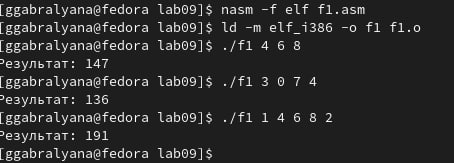{#fig:033 width=70%}

Как видно, программа работает исправно.

**Задание №2**

Создаём файл `f2.asm` и вписываем в него текст программы вычисления выражения $(3 + 2) ∗ 4 + 5$. Затем создаём исполняемый файл и запускаем его (рис. @fig:034).

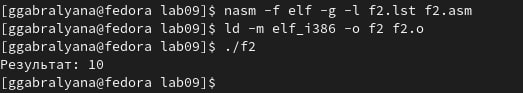{#fig:034 width=70%}

Как можно увидеть, при запуске программа действительно даёт неверный результат.

С помощью отладчика GDB анализируем изменения значений регистров, определяем ошибку и исправляем её.

Для начала загрузим исполняемый файл в отладчик (рис. @fig:035).

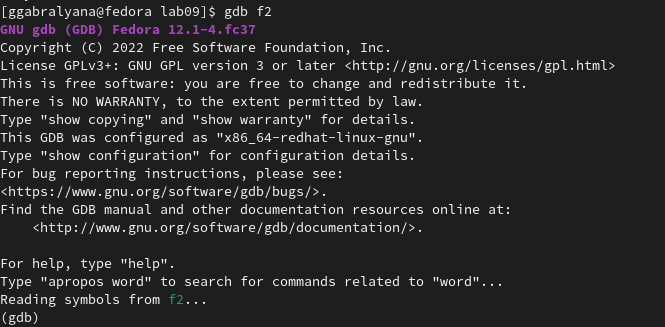{#fig:035 width=70%}

Смотрим дисассимилированный код программы, начиная с метки `_start` (рис. @fig:036).

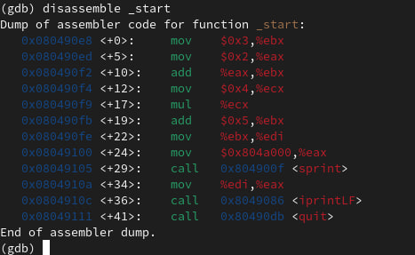{#fig:036 width=70%}

Переходим в режим псевдографики (рис. @fig:037).

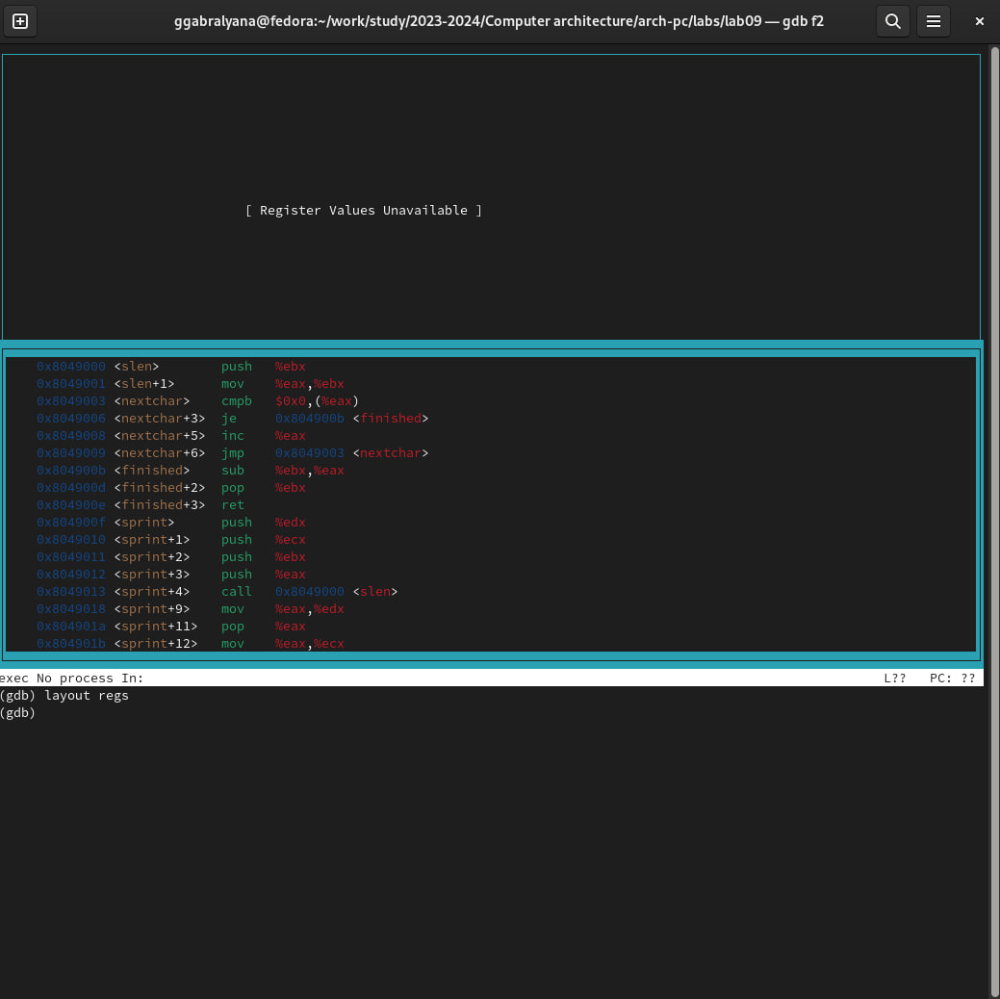{#fig:037 width=70%}

Просматриваем значения регистров (рис. @fig:038).

{#fig:038 width=70%}

Воспользовавшись командой `break` устанавливаем точку останова по адресу на инструкции `add ebx,eax` (рис. @fig:039).

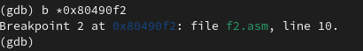{#fig:039 width=70%}

Смотрим значения регистров с помощью команды `i r` (рис. @fig:040).

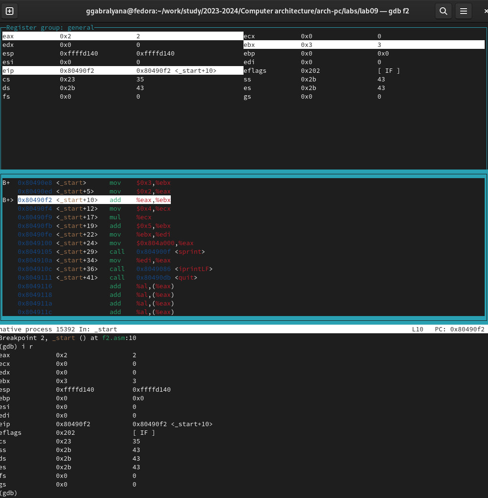{#fig:040 width=70%}

Затем с помощью `si` переходим к следующей инструкции и следим за изменениями значений регистров (рис. @fig:041).

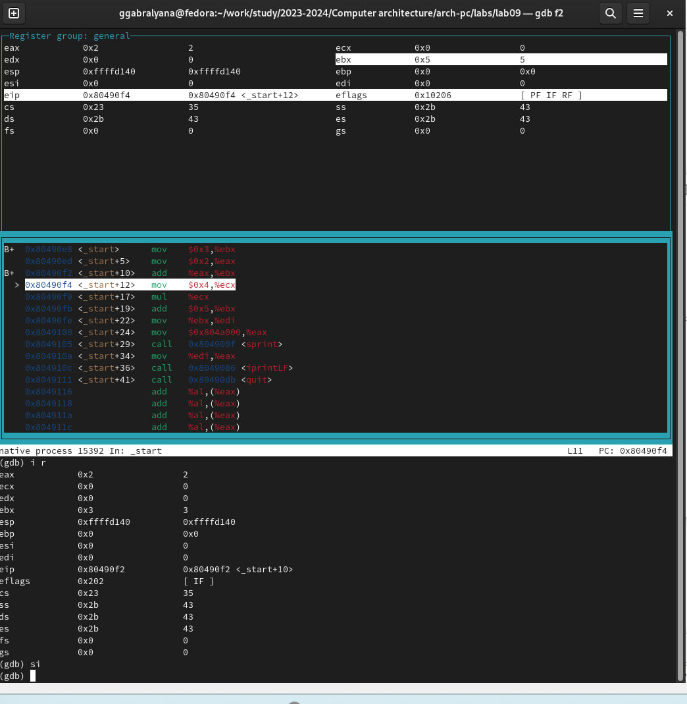{#fig:041 width=70%}

Результат суммы чисел $2$ и $3$ записался в регистр `ebx`. Это и могло послужить проблемой для дальнейшего вычисления произведения. Исправляем это, изменяя значение регистра `eax` и занеся в него значение $5$ с помощью `set` (рис. @fig:042).

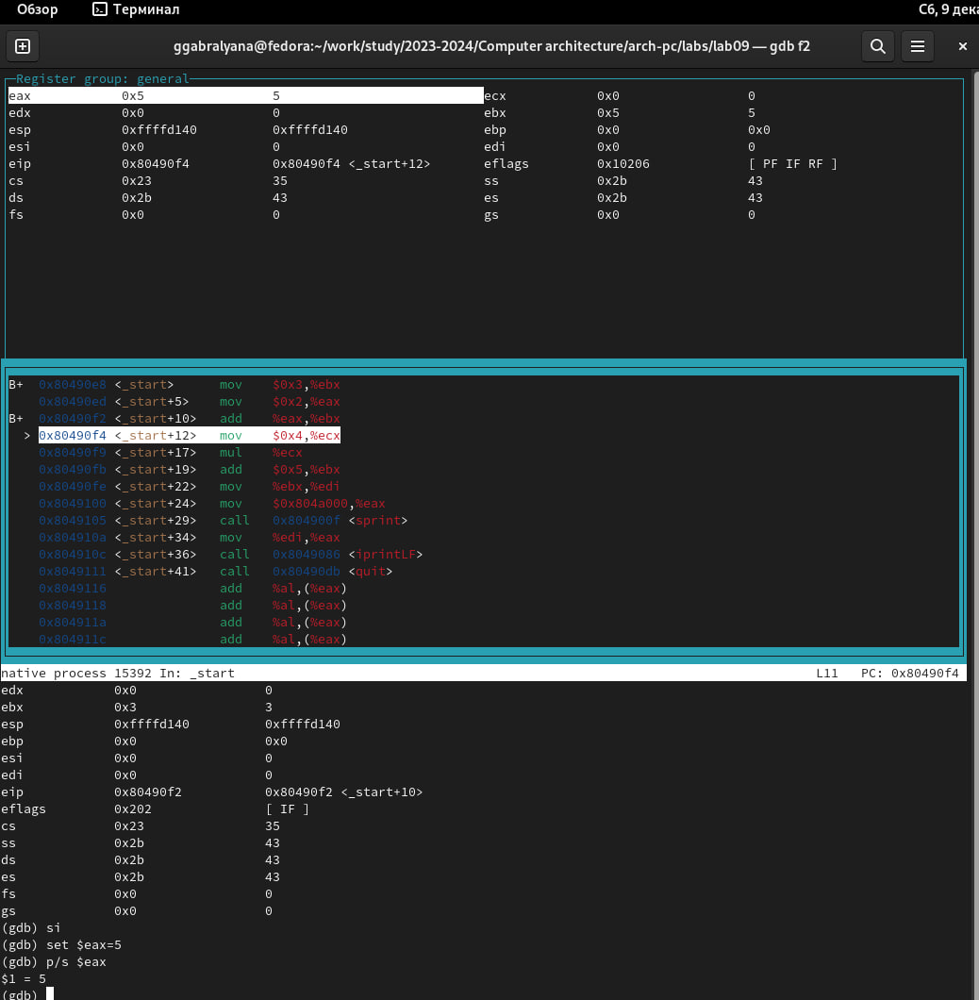{#fig:042 width=70%}

Далее переходим к следующей инструкции (рис. @fig:043).

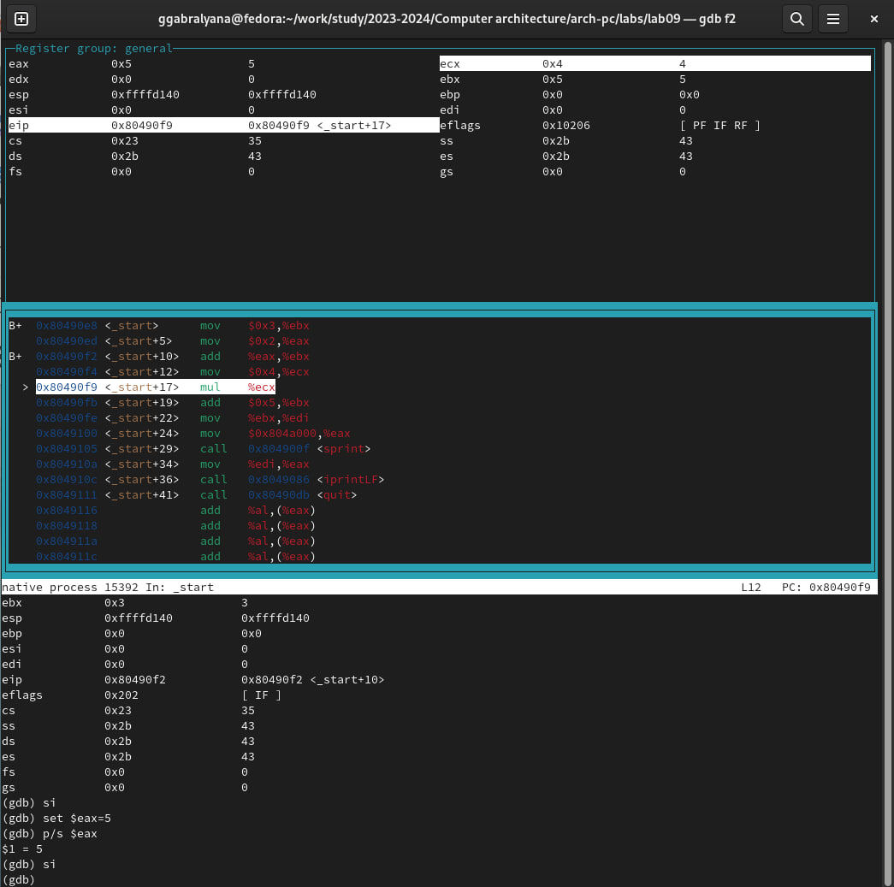{#fig:043 width=70%}

Мы поместили в регистр `ecx` значение $4$ для вычисления произведения. После произведения значения регистров будут следующими: (рис. @fig:044).

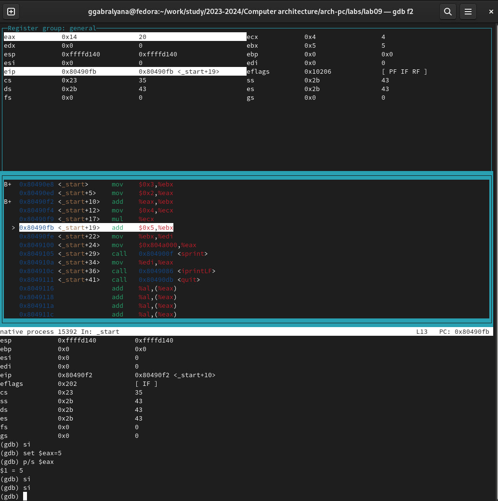{#fig:044 width=70%}

В результате в регистр `eax` было помещено значение произведения $20$. 

К этому значению нужно прибавить $5$. В программе за результат отвечает регистр `ebx`. Поместим в него значение $20 + 5 = 25$ и запустим программу на вывод конечного результата(рис. @fig:045).

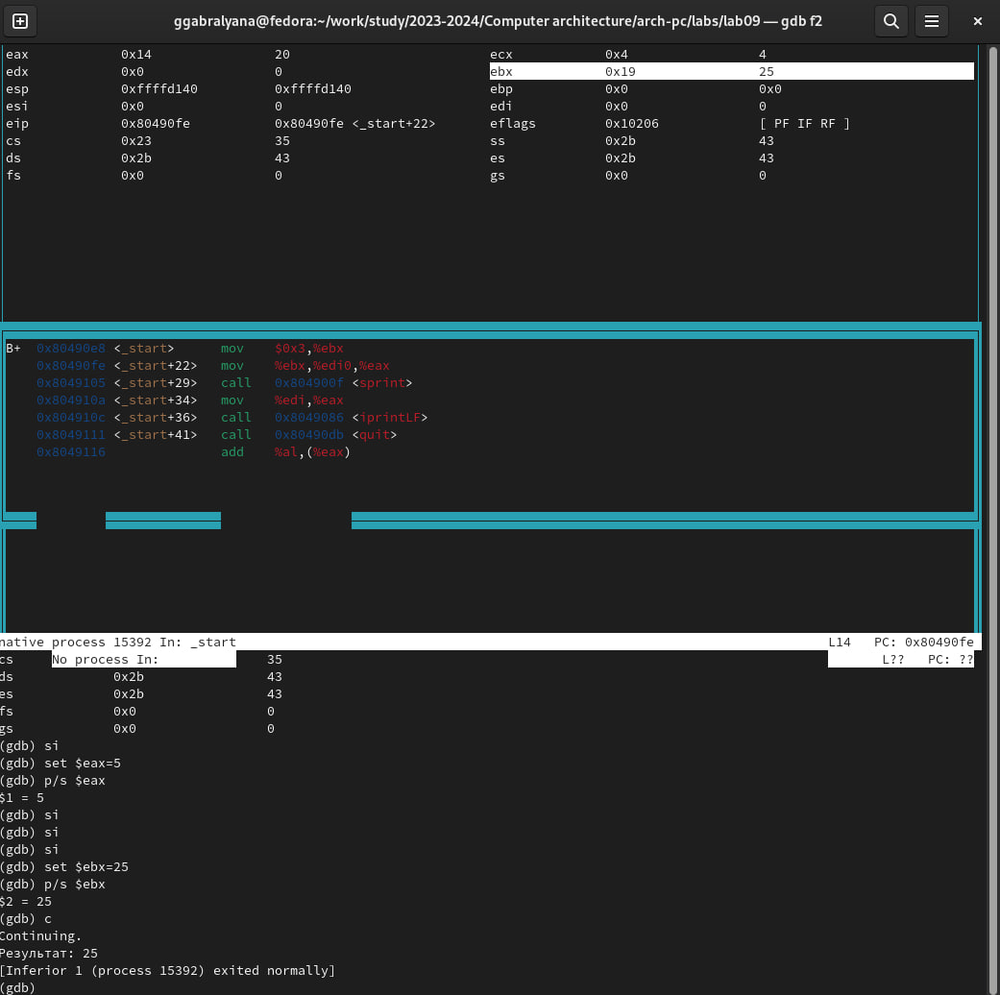{#fig:045 width=70%}

Как видно, с учётом всех изменений программа выдаёт верный результат. Теперь изменяем код программы в файле `f2.asm` (рис. @fig:046).

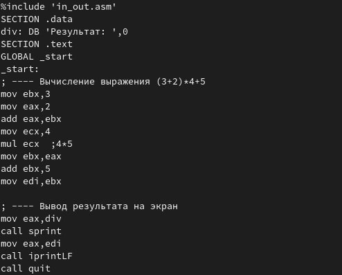{#fig:046 width=70%}

Теперь создаём исполняемый файл и проверяем корректность работы программы (рис. @fig:047).

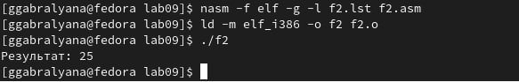{#fig:047 width=70%}

Программа выдаёт верный результат.

# Выводы

В ходе выполнения лабораторной работы мы приобрели навыки написания программ с использованием подпрограмм. Также мы познакомились с методами отладки при помощи GDB и его основными возможностями.

# Список литературы{.unnumbered}

1. GDB: The GNU Project Debugger. — URL: https://www.gnu.org/software/gdb/.
2. GNU Bash Manual. — 2016. — URL: https://www.gnu.org/software/bash/manual/.
3. Midnight Commander Development Center. — 2021. — URL: https://midnight-commander.
org/.
4. NASM Assembly Language Tutorials. — 2021. — URL: https://asmtutor.com/.
5. Newham C. Learning the bash Shell: Unix Shell Programming. — O’Reilly Media, 2005. —
354 с. — (In a Nutshell). — ISBN 0596009658. — URL: http://www.amazon.com/Learningbash-Shell-Programming-Nutshell/dp/0596009658.
6. Robbins A. Bash Pocket Reference. — O’Reilly Media, 2016. — 156 с. — ISBN 978-1491941591.
7. The NASM documentation. — 2021. — URL: https://www.nasm.us/docs.php.
8. Zarrelli G. Mastering Bash. — Packt Publishing, 2017. — 502 с. — ISBN 9781784396879.
9. Колдаев В. Д., Лупин С. А. Архитектура ЭВМ. — М. : Форум, 2018.
10. Куляс О. Л., Никитин К. А. Курс программирования на ASSEMBLER. — М. : Солон-Пресс,
2017.

