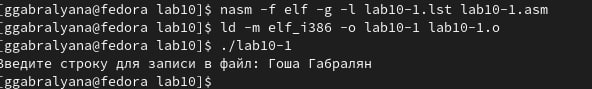
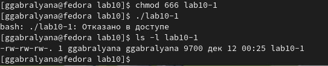
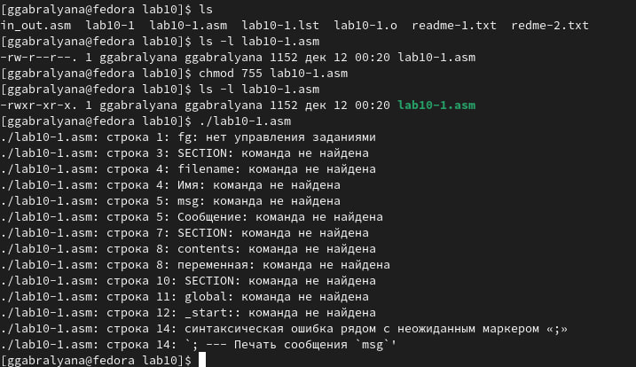
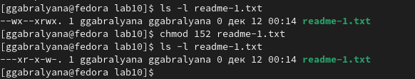
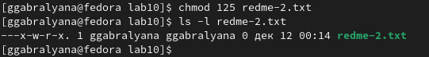
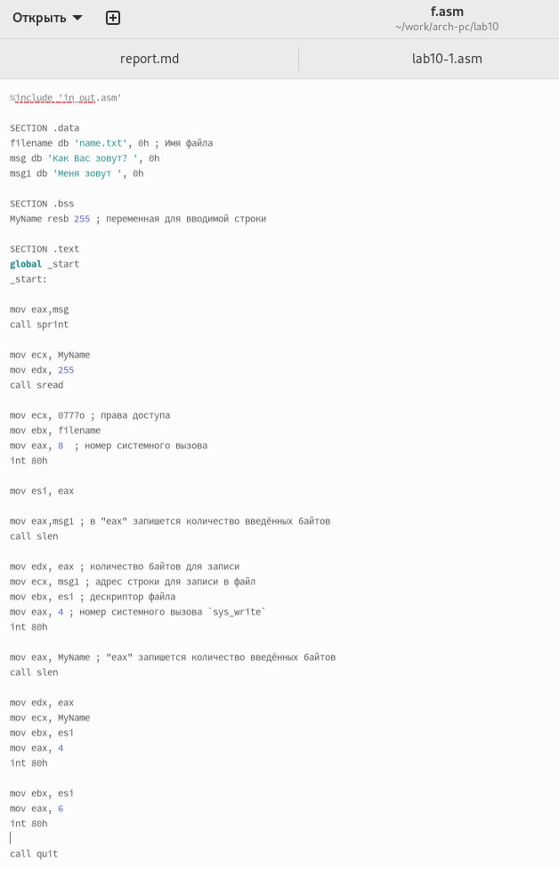
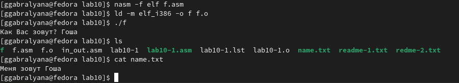
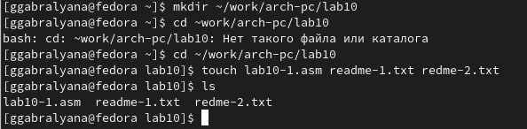

---
## Front matter
title: "Отчёт по лабораторной работе №10"
subtitle: "дисциплина: Архитектура копьютера"
author: "Габралян Георгий Александрович"

## Generic otions
lang: ru-RU
toc-title: "Содержание"

## Bibliography
bibliography: bib/cite.bib
csl: pandoc/csl/gost-r-7-0-5-2008-numeric.csl

## Pdf output format
toc: true # Table of contents
toc-depth: 2
lof: true # List of figures
lot: true # List of tables
fontsize: 12pt
linestretch: 1.5
papersize: a4
documentclass: scrreprt
## I18n polyglossia
polyglossia-lang:
  name: russian
  options:
	- spelling=modern
	- babelshorthands=true
polyglossia-otherlangs:
  name: english
## I18n babel
babel-lang: russian
babel-otherlangs: english
## Fonts
mainfont: PT Serif
romanfont: PT Serif
sansfont: PT Sans
monofont: PT Mono
mainfontoptions: Ligatures=TeX
romanfontoptions: Ligatures=TeX
sansfontoptions: Ligatures=TeX,Scale=MatchLowercase
monofontoptions: Scale=MatchLowercase,Scale=0.9
## Biblatex
biblatex: true
biblio-style: "gost-numeric"
biblatexoptions:
  - parentracker=true
  - backend=biber
  - hyperref=auto
  - language=auto
  - autolang=other*
  - citestyle=gost-numeric
## Pandoc-crossref LaTeX customization
figureTitle: "Рис."
tableTitle: "Таблица"
listingTitle: "Листинг"
lofTitle: "Список иллюстраций"
lotTitle: "Список таблиц"
lolTitle: "Листинги"
## Misc options
indent: true
header-includes:
  - \usepackage{indentfirst}
  - \usepackage{float} # keep figures where there are in the text
  - \floatplacement{figure}{H} # keep figures where there are in the text
---

# Цель работы

Приобретение навыков написания программ для работы с файлами.

# Выполнение лабораторной работы

Сначала создаём каталог для программ лабораторной работы №10 и переходим в него, создаём файлы `lab10-1.asm, readme-1.txt и readme-2.txt` (рис. @fig:001).

{#fig:001 width=70%}

Далее вводим в файл `lab10-1.asm` текст программы записи в файл сообщения. Создаём исполняемый файл, проверяем его (рис. @fig:002).

{#fig:002 width=70%}

Затем, используя команду `chmod` изменяем права файла (рис. @fig:003).

{#fig:003 width=70%}

В доступе отказано, потому что мы заблокировали права на исполнение с помощью команды `chmod 666`.

Сейчас с помощью команды `chmod` изменяем права доступа к файлу `lab10-1.asm` с исходным текстом программы, добавив права на исполнение. Проверяем его выполнение. (рис. @fig:004).

{#fig:004 width=70%}

Как видно, права на исполнение файла есть, но никаких действий не выполняется, так как этот файл содержит только код программы и не содержит никаких команд для консоли.

В соответствии с вариантом №16 нам нужно предоставить права доступа `--x r-x -w-` файлу `readme-1.txt`, а для файла `readme-2.txt` нужны права доступа `001 010 101`. Затем мы проверяем правильность с помощью команды `ls -l`. 

Сначала предоставляем права доступа к файлу `readme-1.txt`. Символьной записи `--x r-x -w-` соответствует десятичная запись `152`. Пишем команду и проверяем её (рис. @fig:005).

{#fig:005 width=70%}

В файле `readme-2.txt` нужно предоставить следующие права доступа: `001 010 101`. (рис. @fig:006).

{#fig:006 width=70%}

Видно что программа сработала верно. 

# Выполнение заданий для самостоятельной работы

Нужно написать программу, работающую по следующему алгоритму:

* Вывод приглашения “Как Вас зовут?”
* ввести с клавиатуры свои фамилию и имя
* создать файл с именем `name.txt`
* записать в файл сообщение “Меня зовут”
* дописать в файл строку введенную с клавиатуры
* закрыть файл

Создаём файл `f.asm` и запишем в него необходимый текст программы. (рис. @fig:007).

{#fig:007 width=70%} 

Создаём исполняемый файл и проверяем его работу. Затем проверяем наличие файла и его содержимое. (рис. @fig:008).

{#fig:008 width=70%} 

Как видно, программа работает исправно.

# Выводы

В ходе выполнения лабораторной работы мы приобрели навыки писания программ для работы с файлами.

# Список литературы{.unnumbered}

1. GDB: The GNU Project Debugger. — URL: https://www.gnu.org/software/gdb/.
2. GNU Bash Manual. — 2016. — URL: https://www.gnu.org/software/bash/manual/.
3. Midnight Commander Development Center. — 2021. — URL: https://midnight-commander.org/.
4. NASM Assembly Language Tutorials. — 2021. — URL: https://asmtutor.com/.
5. Newham C. Learning the bash Shell: Unix Shell Programming. — O’Reilly Media, 2005. — 354 с. — (In a Nutshell). — ISBN 0596009658. — URL: http://www.amazon.com/Learning-bash-Shell-Programming-Nutshell/dp/0596009658.
6. Robbins A. Bash Pocket Reference. — O’Reilly Media, 2016. — 156 с. — ISBN 978-1491941591.
7. The NASM documentation. — 2021. — URL: https://www.nasm.us/docs.php.
8. Zarrelli G. Mastering Bash. — Packt Publishing, 2017. — 502 с. — ISBN 9781784396879.
9. Колдаев В. Д., Лупин С. А. Архитектура ЭВМ. — М. : Форум, 2018.
10. Куляс О. Л., Никитин К. А. Курс программирования на ASSEMBLER. — М. : Солон-Пресс, 2017.

